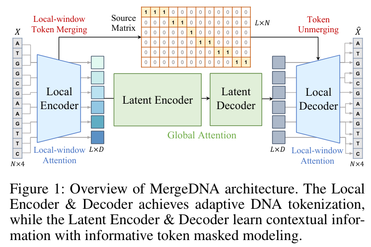
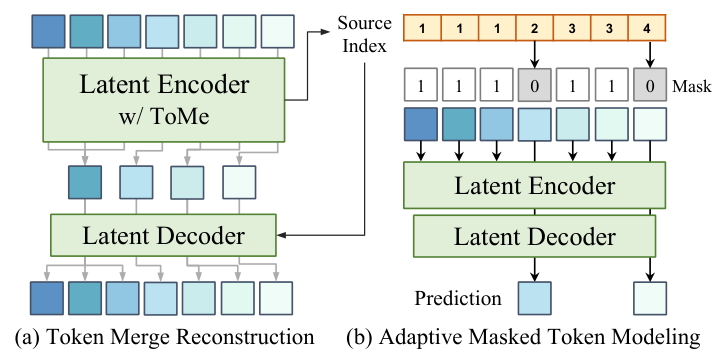
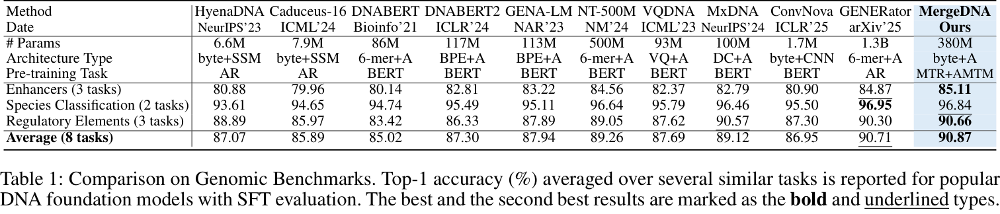
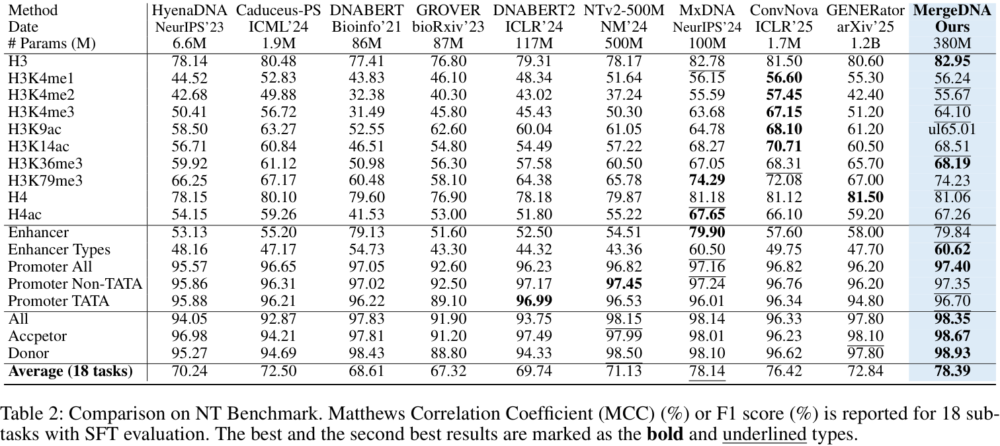
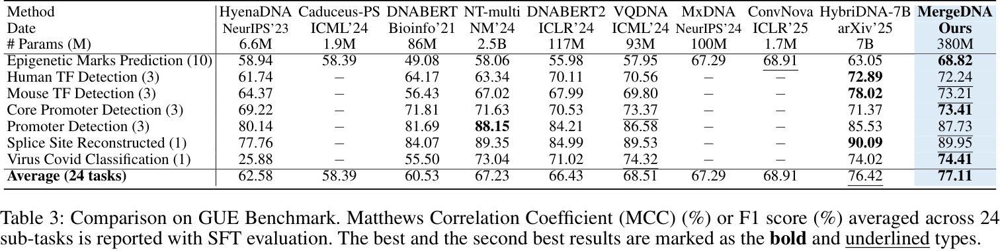
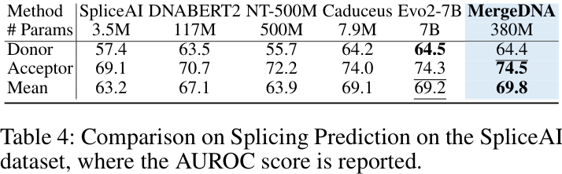
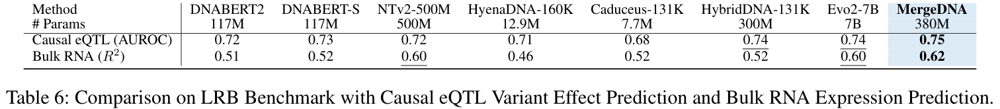
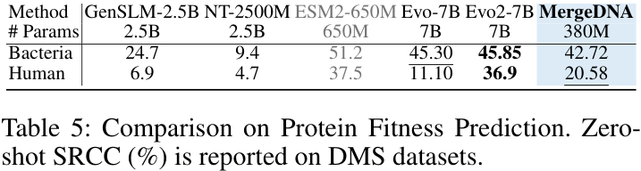
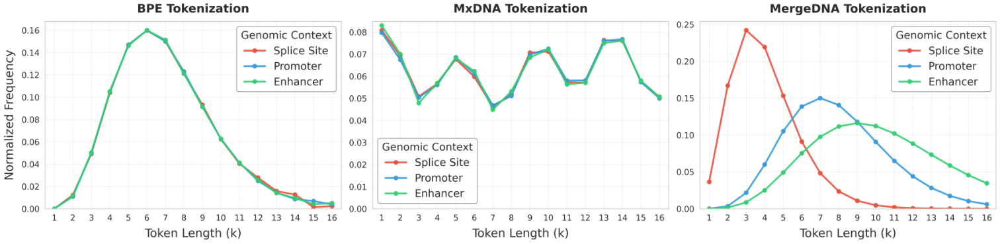
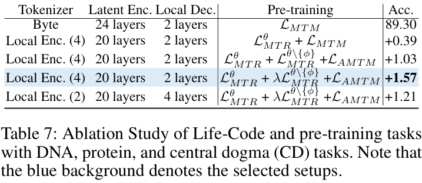

# MergeDNA: Context-aware Genome Modeling with Dynamic Tokenization Through Token Merging

> Full-paper bilingual Markdown reader generated from `MergeDNA.pdf`. Source anchors use page numbers from the PDF and stable block IDs.

## Metadata

- Source PDF: `MergeDNA.pdf`
- Paper type: methods / foundation-model architecture paper for genomic sequence modeling
- Output files: `paper.md`, `source_map.json`, `translation_notes.md`, `assets/`
- Extraction mode: selectable-text PDF with cropped figure/table assets and reconstructed Markdown equations

## Page / Section Index

- p.1: Title, abstract, introduction opening, Fig. 1
- p.2: Introduction continuation, contributions, related work
- p.3-p.4: Methodology, architecture, tokenization, adaptive context modeling, Fig. 2
- p.5-p.6: Experimental setup and benchmark results, Tables 1-5
- p.7: Tokenization analysis, ablation, conclusion, Fig. 3 and Tables 6-7
- p.8-p.9: Acknowledgments and references

## Terminology

| Term | 中文 | Note |
|---|---|---|
| Token Merging / ToMe | Token Merging / ToMe | 逐步合并相似 token 以压缩序列长度的机制。 |
| Local Encoder | 局部编码器 | 带局部窗口约束的可学习 DNA 分词器。 |
| Latent Encoder | 潜在编码器 | 在合并后的 token 序列上用全注意力建模长程上下文。 |
| Source matrix | 源矩阵 | 记录每个合并 token 覆盖哪些原始碱基位置。 |
| Merged Token Reconstruction (MTR) | 合并 token 重建 | 从压缩 token 重建原始序列的预训练目标。 |
| Adaptive Masked Token Modeling (AMTM) | 自适应掩码 token 建模 | 优先掩码高信息 token 并预测它们的目标函数。 |
| SFT | 监督微调 | 在下游任务上对模型进行监督式微调。 |
| AUROC / MCC / SRCC | AUROC / MCC / SRCC | 分别用于分类、相关性或排序质量评估的指标。 |

## Bilingual Reader

**Source:** p.1 S001

**Original:** MergeDNA: Context-aware Genome Modeling with Dynamic Tokenization Through Token Merging

**中文:** MergeDNA：通过 Token Merging 实现动态分词的上下文感知基因组建模

**Source:** p.1 S002

**Original:** Siyuan Li, Kai Yu, Anna Wang, Zicheng Liu, Chang Yu, Jingbo Zhou, Qirong Yang, Yucheng Guo, Xiaoming Zhang, Stan Z. Li. Zhejiang University; Westlake University; BioMap Research.

**中文:** 作者包括 Siyuan Li、Kai Yu、Anna Wang、Zicheng Liu、Chang Yu、Jingbo Zhou、Qirong Yang、Yucheng Guo、Xiaoming Zhang 和 Stan Z. Li；单位为浙江大学、西湖大学和 BioMap Research。

**Source:** p.1 S003

**Original:** Modeling genomic sequences faces two unsolved challenges: the information density varies widely across different regions, while there is no clearly defined minimum vocabulary unit. Relying on either four primitive bases or independently designed DNA tokenizers, existing approaches with naive masked language modeling pre-training often fail to adapt to the varying complexities of genomic sequences. Leveraging Token Merging techniques, this paper introduces a hierarchical architecture that jointly optimizes a dynamic genomic tokenizer and latent Transformers with context-aware pre-training tasks. As for network structures, the tokenization module automatically chunks adjacent bases into words by stacking multiple layers of the differentiable token merging blocks with local-window constraints, then a Latent Encoder captures the global context of these merged words by full-attention blocks. Symmetrically employing a Latent Decoder and a Local Decoder, MergeDNA learns with two pre-training tasks: Merged Token Reconstruction simultaneously trains the dynamic tokenization module and adaptively filters important tokens, while Adaptive Masked Token Modeling learns to predict these filtered tokens to capture informative contents. Extensive experiments show that MergeDNA achieves superior performance on three popular DNA benchmarks and several multi-omics tasks with fine-tuning or zero-shot evaluation, outperforming typical tokenization methods and large-scale DNA foundation models.

**中文:** 基因组序列建模面临两个尚未解决的挑战：不同区域的信息密度差异很大，而且不存在清晰定义的最小词汇单元。现有方法若依赖四种原始碱基，或依赖独立设计的 DNA 分词器，并配合朴素的掩码语言建模预训练，往往难以适应基因组序列复杂度的变化。本文借助 Token Merging 技术提出一种层次化架构，通过上下文感知的预训练任务联合优化动态基因组分词器与潜在 Transformer。在网络结构上，分词模块堆叠多层带局部窗口约束的可微 Token Merging 模块，自动将相邻碱基切分为“词”；随后 Latent Encoder 通过全注意力模块捕获这些合并词的全局上下文。MergeDNA 对称地使用 Latent Decoder 和 Local Decoder，并通过两个预训练任务学习：Merged Token Reconstruction 同时训练动态分词模块并自适应过滤重要 token；Adaptive Masked Token Modeling 则预测这些被筛选的 token，以捕获信息含量更高的内容。大量实验表明，MergeDNA 在三个常用 DNA benchmark 和若干多组学任务上，无论微调还是零样本评估，都取得了更优性能，超过典型分词方法和大规模 DNA foundation model。

## 1 Introduction

**Source:** p.1 S004

**Original:** Modeling genomic DNA sequences with foundation models is an emerging frontier that promises to advance bioinformatics and precision medicine. DNA is often likened to a natural language carrying the code of life, yet it poses unique modeling challenges far beyond ordinary text. Firstly, genomic information is distributed unevenly. Only around 2% of the human genome consists of coding sequences (CDS), densely packed with functional information, whereas the vast majority is non-coding sequence (nCDS) with regulatory or unknown functions, which contains repetitive or less informative content. Secondly, unlike natural languages with semantic words, DNA has no inherent word boundaries or predefined vocabulary units. The meaningful units of DNA vary by context: a biologically relevant motif might be 3 bases as a codon, 6-10 bases as a transcription factor binding site, or even longer sequences. This makes fixed tokenization schemes inadequate.

**中文:** 用 foundation model 建模基因组 DNA 序列，是一个有望推动生物信息学和精准医学的新兴前沿。DNA 常被类比为承载“生命代码”的自然语言，但它的建模挑战远超普通文本。第一，基因组信息分布并不均匀。人类基因组中只有约 2% 是编码序列（CDS），这些区域密集承载功能信息；绝大多数则是具有调控或未知功能的非编码序列（nCDS），其中包含重复或信息量较低的内容。第二，不同于带有语义词的自然语言，DNA 没有天然词边界，也没有预定义词汇单元。DNA 中有意义的“单元”随上下文变化：生物学相关 motif 可能是 3 个碱基的密码子、6-10 个碱基的转录因子结合位点，甚至更长序列。因此，固定分词方案并不充分。

**Source:** p.1 S005

**Original:** Third, DNA sequences are extremely long, often spanning tens of thousands to millions of bases, requiring models that can capture both short-range motifs and long-range dependencies efficiently. Naive pre-training objectives may fail to focus on the truly important parts of these vast sequences. These factors collectively make DNA fundamentally distinct from human language and call for a new class of sequence modeling architectures. Recent studies have explored long-sequence architectures, DNA tokenization strategies, and pre-training objectives, but most works optimize these dimensions in isolation and lack a unified mechanism to address all three DNA modeling challenges.

**中文:** 第三，DNA 序列极长，常常跨越数万到数百万个碱基，因此模型必须高效捕获短程 motif 与长程依赖。朴素预训练目标可能无法聚焦这些庞大序列中真正重要的部分。这些因素共同使 DNA 与人类语言存在根本差异，也呼唤一类新的序列建模架构。近期研究分别探索了长序列架构、DNA 分词策略和预训练目标，但大多数工作是孤立优化这些维度，缺少能够同时处理三类 DNA 建模挑战的统一机制。

**Source:** p.2 S006

**Original:** This work argues that effective genome-scale modeling requires two core capabilities: a context-sensitive tokenizer that learns to segment DNA into variable-length units based on local structure and semantics, and adaptive pre-training objectives that prioritize information-dense regions for representation learning. MergeDNA is a context-aware genome modeling framework that dynamically adapts tokenization and pre-training to genomic context. Its core is a hierarchical autoencoder-style Transformer that compresses and reconstructs DNA sequences with a differentiable tokenizer and a long-range context model.

**中文:** 本文认为，有效的基因组尺度建模需要两种核心能力：其一，是上下文敏感的分词器，能够根据局部结构与语义把 DNA 切分为可变长度单元；其二，是自适应预训练目标，能够优先把表示学习资源分配给信息密集区域。MergeDNA 是一种上下文感知的基因组建模框架，可根据基因组上下文动态调整分词与预训练。其核心是层次化自编码器式 Transformer，使用可微分词器和长程上下文模型来压缩并重建 DNA 序列。

**Source:** p.2 S007

**Original:** MergeDNA designs a Local Encoder composed of stacked local-window attention blocks with differentiable token merging, enabling adjacent bases to be chunked into variable-length tokens based on local similarity. These merged tokens are processed by a global-context Latent Encoder using full attention, and a symmetric Latent Decoder and Local Decoder reconstruct the input sequence. Two pre-training objectives jointly supervise the model: Merged Token Reconstruction preserves key information while filtering redundancies, and Adaptive Masked Token Modeling selectively masks and predicts important tokens identified through token merging.

**中文:** MergeDNA 设计了由多层局部窗口注意力块和可微 Token Merging 组成的 Local Encoder，使模型能根据局部相似性把相邻碱基切成可变长度 token。这些合并后的 token 再由使用全注意力的全局上下文 Latent Encoder 处理；对称的 Latent Decoder 与 Local Decoder 则重建输入序列。模型由两个预训练目标共同监督：Merged Token Reconstruction 在过滤冗余的同时保留关键信息；Adaptive Masked Token Modeling 则选择性掩码并预测通过 token merging 识别出的重要 token。

### F001. MergeDNA 架构总览

**Placed near:** p.2 S007  
**Source:** p.1 caption

**Original caption:** Figure 1: Overview of MergeDNA architecture. The Local Encoder & Decoder achieves adaptive DNA tokenization, while the Latent Encoder & Decoder learn contextual information with informative token masked modeling.

**中文图注:** 图 1：MergeDNA 架构总览。Local Encoder 与 Decoder 实现自适应 DNA 分词，Latent Encoder 与 Decoder 通过信息 token 掩码建模学习上下文信息。

**Reading note:** Inspect the two-level flow: local tokenization first compresses bases into merged tokens, then latent full attention models global context before reconstruction.

**Source:** p.2 S008

**Original:** The paper contributes a unified hierarchical architecture integrating a learnable DNA tokenizer with long-range sequence modeling; context-aware pre-training tasks that adapt to varying information density; and strong empirical results across three major DNA benchmarks plus RNA and protein downstream tasks.

**中文:** 本文贡献包括：提出一种统一的层次化架构，将可学习 DNA 分词器与长程序列建模紧密结合；提出能适应基因组信息密度变化的上下文感知预训练任务；并在三个主要 DNA benchmark 以及 RNA、蛋白质下游任务上取得强经验结果。

## 2 Related Work

**Source:** p.2 S009

**Original:** Related work on DNA foundation models spans long sequence modeling, DNA tokenization, pre-training objectives, and pre-training domains. SSMs, hierarchical attention, and hybrid SSM-attention designs improve scalability; tokenization ranges from byte-level encodings to k-mers and learned vocabularies; objectives include BERT-style and autoregressive-like masked token modeling; and domains range from human reference genomes to multi-species, prokaryotic, plant, metagenomic, and multi-omics corpora.

**中文:** DNA foundation model 的相关工作主要覆盖长序列建模、DNA 分词、预训练目标和预训练领域。SSM、层次注意力以及 SSM-注意力混合设计提升了可扩展性；分词策略从 byte-level 编码扩展到 k-mer 与可学习词表；目标函数包括 BERT 式以及类自回归的掩码 token 建模；预训练领域则覆盖人类参考基因组、多物种、原核生物、植物、宏基因组和多组学语料。

**Source:** p.2 S010

**Original:** Byte-level architectures in NLP and genomics show that multi-scale or SSM-based models can process very long inputs without a subword tokenizer. Recent systems such as BLT and HNet introduce learned chunking or differentiable segmentation. DNA models with raw nucleotides as input also follow this byte-level line, while classical BPE, k-mers, and learnable dictionaries remain widely explored alternatives.

**中文:** NLP 和基因组学中的 byte-level 架构表明，多尺度或基于 SSM 的模型可以在不使用子词分词器的情况下处理超长输入。近期 BLT、HNet 等系统引入了可学习 chunking 或可微分割。以原始核苷酸为输入的 DNA 模型也属于这一 byte-level 路线；与此同时，传统 BPE、k-mer 和可学习字典仍是广泛探索的替代方案。

## 3 Methodology

**Source:** p.3 S011

**Original:** A DNA sequence can be seen as a string in the nucleotide alphabet $D=\{A,T,C,G\}$. We denote a sequence of length $N$ as $X=(x_1,x_2,\ldots,x_N)\in D^N$, where each $x_i\in D$. A DNA tokenizer $T:D^N\to V^L$ segments $X$ into a sequence of $L$ tokens $Z_L=(z_1,\ldots,z_L)$ and maps to a vocabulary $V$ with $N\ge L$. Given DNA sequences with a causal mask $M\in\{0,1\}^N$, a model $f_\theta$ with Attention blocks can be trained with masked token modeling (MTM).

**中文:** DNA 序列可被视为核苷酸字母表 $D=\{A,T,C,G\}$ 上的字符串。长度为 $N$ 的序列记作 $X=(x_1,x_2,\ldots,x_N)\in D^N$，其中每个 $x_i\in D$。DNA 分词器 $T:D^N\to V^L$ 将 $X$ 切分为 $L$ 个 token 的序列 $Z_L=(z_1,\ldots,z_L)$，并映射到词表 $V$，其中 $N\ge L$。给定带因果掩码 $M\in\{0,1\}^N$ 的 DNA 序列，带 Attention block 的模型 $f_\theta$ 可通过 masked token modeling（MTM）目标进行训练。

### E001. Equation (1)

**Placed near:** p.3 S011  
**Source:** p.3 E001

**Original equation:**
$$
L_{\mathrm{MLM}}(\theta)=-\frac{1}{L}\sum_{i=1}^{L}\log P(x_i\mid X * M;\theta)\tag{1}
$$

**中文说明:** 该式是 masked token modeling 目标：对被掩码 token 的条件概率取负对数并在 $L$ 个 token 上平均，用来鼓励模型从上下文推断被掩码位置。

**Confidence:** medium

**Source:** p.3 S012

**Original:** MergeDNA adopts an autoencoder style with four components. The Local Encoder $E_\phi$ acts as a learnable DNA tokenizer with local contexts, producing a tokenized sequence $Z_L\in\mathbb{R}^{L\times D}$ and a binary source matrix $S\in\{0,1\}^{L\times N}$. The source matrix records which original positions in $X$ were merged to form each token in $Z_L$.

**中文:** MergeDNA 采用包含四个组件的自编码器式设计。Local Encoder $E_\phi$ 作为带局部上下文的可学习 DNA 分词器，输出 token 序列 $Z_L\in\mathbb{R}^{L\times D}$ 和二值 source matrix $S\in\{0,1\}^{L\times N}$。source matrix 记录 $X$ 中哪些原始位置被合并成 $Z_L$ 中的每个 token。

### E002. Equation (2)

**Placed near:** p.3 S012  
**Source:** p.3 E002

**Original equation:**
$$
Z_L,S=E_{\phi}(X)\tag{2}
$$

**中文说明:** Local Encoder $E_{\phi}$ 接收原始 DNA 序列 $X$，输出合并后的 token 表示 $Z_L$ 以及记录来源位置的 source matrix $S$。

**Confidence:** high

**Source:** p.3 S013

**Original:** The Latent Encoder $E_\psi$ captures long-range dependencies across the tokenized sequence using full attention. A lightweight symmetric Latent Decoder $E_\omega$ maps contextual embeddings back toward token space and outputs $\hat{Z}_L=E_\omega(Z'_L)$. Together, $E_\psi$ and $E_\omega$ form a token-level autoencoder and provide reconstruction-based learning signals to the tokenizer and context encoder.

**中文:** Latent Encoder $E_\psi$ 使用全注意力在 token 化序列上捕获长程依赖。轻量、对称的 Latent Decoder $E_\omega$ 将上下文化嵌入映射回 token 空间，并输出 $\hat{Z}_L=E_\omega(Z'_L)$。$E_\psi$ 与 $E_\omega$ 共同构成 token 层面的自编码器，并向分词器和上下文编码器提供基于重建的学习信号。

### E003. Equation (3)

**Placed near:** p.3 S013  
**Source:** p.3 E003

**Original equation:**
$$
Z'_L=E_{\psi}(Z_L)\tag{3}
$$

**中文说明:** Latent Encoder $E_{\psi}$ 在合并 token 序列 $Z_L$ 上建模全局上下文，得到上下文化表示 $Z'_L$。

**Confidence:** high

**Source:** p.3 S014

**Original:** The Local Decoder $E_\zeta$ maps the Latent Decoder output $\hat{Z}_L$ back to the original base space and serves as a detokenizer. It first applies token unmerging $U(\cdot,\cdot)$ using the source matrix $S$ to upsample the $L$ decoded tokens to length $N$, then applies local attention to refine details and output the reconstructed sequence $\hat{X}=(\hat{x}_1,\ldots,\hat{x}_N)$.

**中文:** Local Decoder $E_\zeta$ 将 Latent Decoder 的输出 $\hat{Z}_L$ 映射回原始碱基层空间，相当于 detokenizer。它先利用 source matrix $S$ 执行 token unmerging $U(\cdot,\cdot)$，把 $L$ 个解码 token 上采样回长度 $N$，再通过局部注意力细化细节并输出重建序列 $\hat{X}=(\hat{x}_1,\ldots,\hat{x}_N)$。

### E004. Equation (4)

**Placed near:** p.3 S014  
**Source:** p.3 E004

**Original equation:**
$$
\hat{X}=E_{\zeta}(\bar{Z}_N),\qquad \bar{Z}_N=U(\hat{Z}_L,S)=S^{\top}\hat{Z}_L\tag{4}
$$

**中文说明:** 该组公式表示 Local Decoder 先用 $S$ 将解码后的 token 表示反合并为长度 $N$ 的序列表示 $\bar{Z}_N$，再通过 $E_{\zeta}$ 重建原始碱基序列 $\hat{X}$。

**Confidence:** medium

**Source:** p.3 S015

**Original:** The Local Encoder uses a differentiable token merging mechanism based on ToMe. Each Local Encoder layer applies local self-attention followed by a token merging module. Given the $l$-th layer and input sequence length $N_{l-1}$, the merging module selects $r_l$ pairs of tokens within each window, computes averages, and reduces the sequence by $r_l$ tokens.

**中文:** Local Encoder 使用基于 ToMe 的可微 Token Merging 机制。每个 Local Encoder 层先执行局部自注意力，再执行 token merging 模块。给定第 $l$ 层和输入序列长度 $N_{l-1}$，合并模块在每个窗口内选择 $r_l$ 对 token，计算平均表示，并将序列减少 $r_l$ 个 token。

### E005. Equation (5)

**Placed near:** p.3 S015  
**Source:** p.3 E005

**Original equation:**
$$
S^{(l)}, Z^{(l)}_{N_l}=\mathrm{LocalToMeAttn}^{(l)}\!\left(Z^{(l-1)}_{N_{l-1}},S^{(l-1)},r_l\right)\tag{5}
$$

**中文说明:** 第 $l$ 层 LocalToMeAttention 根据上一层 token 表示、上一层 source matrix 和本层合并数量 $r_l$，输出更新后的 source matrix 与更短的 token 序列。

**Confidence:** medium

**Source:** p.4 S016

**Original:** Merged Token Reconstruction (MTR) forces the network to reconstruct the original sequence from compressed tokens. The loss is computed as cross-entropy between $\hat{X}$ and $X$. A compression-ratio sampling strategy randomly chooses how many tokens to retain per iteration, exposing $E_\phi$ to a wider range of segmentations and preventing overfitting to a particular compression rate.

**中文:** Merged Token Reconstruction（MTR）要求网络从压缩 token 重建原始序列。该损失以 $\hat{X}$ 与 $X$ 之间的交叉熵计算。训练中使用压缩比例采样策略，每次迭代随机选择保留多少 token，使 $E_\phi$ 接触更广的分割范围，避免过拟合到某一个压缩率。

### E006. Equation (6)

**Placed near:** p.4 S016  
**Source:** p.4 E006

**Original equation:**
$$
L_{\mathrm{MTR}}(\theta)=-\frac{1}{N}\sum_{i=1}^{N}\log P(\hat{X}_i\mid X_i;\theta)\tag{6}
$$

**中文说明:** MTR 损失在 $N$ 个碱基位置上平均重建的负对数似然，用来训练压缩 token 仍保留可恢复原序列的信息。

**Confidence:** medium

**Source:** p.4 S017

**Original:** For adaptive context modeling, MergeDNA modifies the Latent Encoder during pre-training to select $K$ salient tokens. It replaces standard attention in $E_\psi$ with ToMe-style global token merging and obtains $(Z'_K,S')=E_\psi(Z_L,S)$, where $Z'_K\in\mathbb{R}^{K\times D}$ with $K<L$. The latent tokens are then unmerged back before decoding and reconstruction, yielding a latent MTR loss $L_{\mathrm{MTR}}(\theta\setminus\{\phi\})$ while keeping the Local Encoder fixed.

**中文:** 在自适应上下文建模中，MergeDNA 在预训练阶段修改 Latent Encoder，使其选择 $K$ 个显著 token。模型以 ToMe 式全局 token merging 替换 $E_\psi$ 中的标准注意力，得到 $(Z'_K,S')=E_\psi(Z_L,S)$，其中 $Z'_K\in\mathbb{R}^{K\times D}$ 且 $K<L$。随后这些 latent token 在解码重建前被反合并回原长度，从而在固定 Local Encoder 的同时形成 latent MTR 损失 $L_{\mathrm{MTR}}(\theta\setminus\{\phi\})$。

**Source:** p.4 S018

**Original:** Adaptive Masked Token Modeling uses the latent merging outcome $S'$ to decide which tokens to mask. If $g_i=\sum_{j=1}^{L} S'_{i,j}$ is the number of local tokens grouped into the $i$-th latent token, the paper assigns a weight inversely proportional to group size, for example $w_i=1/g_i$. The selected local-token mask $M_L\in\{0,1\}^{L}$ is mapped back to base positions as $M_N=U(M_L,S)\in\{0,1\}^{N}$, and the model predicts the masked high-information positions.

**中文:** Adaptive Masked Token Modeling 使用 latent merging 的结果 $S'$ 决定掩码哪些 token。若 $g_i=\sum_{j=1}^{L} S'_{i,j}$ 表示第 $i$ 个 latent token 中聚合的局部 token 数量，则论文给该组分配与组大小成反比的权重，例如 $w_i=1/g_i$。被选中的局部 token 掩码 $M_L\in\{0,1\}^{L}$ 再被映射回碱基位置 $M_N=U(M_L,S)\in\{0,1\}^{N}$，模型预测这些被掩码的高信息位置。

### E007. Equation (7)

**Placed near:** p.4 S018  
**Source:** p.4 E007

**Original equation:**
$$
L_{\mathrm{AMTM}}(\theta)=-\frac{1}{K}\sum_{i:\,M_N(i)=1}\log P(\hat{X}_i\mid X * M_N;\theta)\tag{7}
$$

**中文说明:** AMTM 损失只在被 $M_N$ 标记为掩码的高信息碱基位置上计算，使模型重点预测通过 token merging 识别出的重要区域。

**Confidence:** medium

**Source:** p.4 S019

**Original:** The full pre-training objective consists of three forward passes: the standard MTR loss, a down-weighted latent MTR loss, and the AMTM loss. The paper sets $\lambda=0.25$ in practice so that the model learns to recover dropped information without overweighting low-information content.

**中文:** 完整预训练目标由三次前向传播构成：标准 MTR 损失、降权后的 latent MTR 损失以及 AMTM 损失。论文实践中设定 $\lambda=0.25$，使模型学习恢复被丢弃的信息，同时避免低信息内容在训练信号中过重。

### E008. Equation (8)

**Placed near:** p.4 S019  
**Source:** p.4 E008

**Original equation:**
$$
L_{\mathrm{total}}=L_{\mathrm{MTR}}(\theta)+\lambda L_{\mathrm{MTR}}(\theta\setminus\{\phi\})+L_{\mathrm{AMTM}}(\theta)\tag{8}
$$

**中文说明:** 总损失由标准 MTR、降权 latent MTR 和 AMTM 三部分组成；其中 $\theta\setminus\{\phi\}$ 表示 latent MTR 步骤不更新 Local Encoder 参数。

**Confidence:** high

### F002. MergeDNA 预训练任务

**Placed near:** p.4 S016-S019  
**Source:** p.4 caption

**Original caption:** Figure 2: Pre-training of MergeDNA for (a) Local Encoder & Decoder and (b) Latent Encoder & Decoder.

**中文图注:** 图 2：MergeDNA 的预训练流程，包括 (a) Local Encoder 与 Decoder 的 Token Merge Reconstruction，以及 (b) Latent Encoder 与 Decoder 的 Adaptive Masked Token Modeling。

**Reading note:** Panel (a) corresponds to reconstructing from merged tokens; panel (b) shows selecting salient positions for adaptive masking.

## 4 Experiments

**Source:** p.5 S020

**Original:** MergeDNA has 380M parameters, embedding dimension D = 1024, and local window size 16. The Local Encoder and Decoder use 4 and 2 Local ToMeAttention blocks; the Latent Encoder and Decoder use 20 and 4 Transformer blocks. The model is pre-trained on the Multi-Species Genomes corpus for 100K iterations with AdamW, learning rate 1e-4, and sequence length 4096. The local encoder output length is L = N/2 and latent encoder length is K = L/2.

**中文:** MergeDNA 包含 380M 参数，embedding 维度 D = 1024，局部窗口大小为 16。Local Encoder 和 Decoder 分别使用 4 个与 2 个 Local ToMeAttention block；Latent Encoder 和 Decoder 分别使用 20 个与 4 个 Transformer block。模型在 Multi-Species Genomes 语料上使用 AdamW 预训练 100K 次迭代，学习率 1e-4，序列长度 4096。Local Encoder 输出长度为 L = N/2，Latent Encoder 长度为 K = L/2。

**Source:** p.5 S021

**Original:** For downstream tasks, sequence-level tasks discard both decoders and fine-tune a classification head on the latent encoder output. Token-level tasks retain the Local Decoder to recover sequence resolution and fine-tune a token-level prediction head. Baselines cover SSMs, standard Transformers, hybrid models, CNNs, and tokenizer types including byte-level, k-mer, BPE, and dynamic DNA tokenizers.

**中文:** 在下游任务中，序列级任务丢弃两个 decoder，并在 Latent Encoder 输出上微调分类头。token 级任务保留 Local Decoder 以恢复序列分辨率，并微调 token 级预测头。基线模型覆盖 SSM、标准 Transformer、混合模型、CNN，以及 byte-level、k-mer、BPE 和动态 DNA 分词器等分词类型。

**Source:** p.5 S022

**Original:** On Genomic Benchmarks, MergeDNA reaches the highest overall top-1 accuracy of 90.87%, outperforming prior DNA foundation models. It is state of the art on enhancer tasks and regulatory-element tasks while remaining competitive on species classification.

**中文:** 在 Genomic Benchmarks 上，MergeDNA 取得最高总体 top-1 accuracy 90.87%，超过此前 DNA foundation model。在 enhancer 任务和 regulatory element 任务上达到最佳结果，同时在 species classification 上保持竞争力。

### T001. Genomic Benchmarks 对比

**Placed near:** p.5 S022  
**Source:** p.5 caption

**Original caption:** Table 1: Comparison on Genomic Benchmarks. Top-1 accuracy (%) averaged over several similar tasks is reported for popular DNA foundation models with SFT evaluation.

**中文表注:** 表 1：Genomic Benchmarks 对比。报告多个相似任务平均后的 top-1 accuracy（%），用于比较常见 DNA foundation model 的 SFT 评估结果。

**Source:** p.6 S023

**Original:** On the Nucleotide Transformer benchmark, MergeDNA obtains the best overall average score of 78.39, slightly above MxDNA and substantially higher than other baselines. It ranks at or near the top for most individual tasks, including best MCC on 10 of 18 tasks.

**中文:** 在 Nucleotide Transformer benchmark 上，MergeDNA 获得最佳总体平均分 78.39，略高于 MxDNA，并显著高于其他基线。多数单项任务中，它都排名第一或接近第一，包括在 18 个任务中的 10 个上取得最佳 MCC。

### T002. NT Benchmark 对比

**Placed near:** p.6 S023  
**Source:** p.5 caption

**Original caption:** Table 2: Comparison on NT Benchmark. Matthews Correlation Coefficient (MCC) (%) or F1 score (%) is reported for 18 subtasks with SFT evaluation.

**中文表注:** 表 2：NT Benchmark 对比。报告 18 个子任务在 SFT 评估下的 MCC（%）或 F1 score（%）。

**Source:** p.6 S024

**Original:** On GUE, which aggregates 24 short-range subtasks, MergeDNA delivers the highest mean performance of 77.11%, edging out the much larger HybriDNA-7B and outperforming other foundation models. The results suggest broad improvements from dynamic tokenization and dual-context pre-training.

**中文:** 在包含 24 个短程子任务的 GUE 上，MergeDNA 取得最高平均性能 77.11%，略高于规模更大的 HybriDNA-7B，并超过其他 foundation model。这些结果表明，动态分词与双上下文预训练带来了广泛提升。

### T003. GUE Benchmark 对比

**Placed near:** p.6 S024  
**Source:** p.6 caption

**Original caption:** Table 3: Comparison on GUE Benchmark. MCC (%) or F1 score (%) averaged across 24 subtasks is reported with SFT evaluation.

**中文表注:** 表 3：GUE Benchmark 对比。报告 24 个子任务平均后的 MCC（%）或 F1 score（%），采用 SFT 评估。

**Source:** p.6 S025

**Original:** For splicing prediction on SpliceAI, MergeDNA achieves mean AUROC 69.8, outperforming SpliceAI and prior DNA foundation models. For long-range expression prediction, it reaches AUROC 0.75 on causal eQTL prediction and R2 0.62 on bulk RNA expression prediction, both new state-of-the-art results in the reported comparison.

**中文:** 在 SpliceAI 剪接预测中，MergeDNA 的平均 AUROC 为 69.8，超过 SpliceAI 和此前 DNA foundation model。在长程表达预测中，它在 causal eQTL 预测上达到 AUROC 0.75，在 bulk RNA expression 预测上达到 R2 0.62，是报告比较中的新最佳结果。

### T004. SpliceAI 剪接预测

**Placed near:** p.6 S025  
**Source:** p.6 caption

**Original caption:** Table 4: Comparison on Splicing Prediction on the SpliceAI dataset, where the AUROC score is reported.

**中文表注:** 表 4：SpliceAI 数据集上的剪接预测对比，报告 AUROC。

### T006. LRB 长程任务对比

**Placed near:** p.6 S025  
**Source:** p.7 caption

**Original caption:** Table 6: Comparison on LRB Benchmark with Causal eQTL Variant Effect Prediction and Bulk RNA Expression Prediction.

**中文表注:** 表 6：LRB Benchmark 对比，包括 causal eQTL variant effect prediction 和 bulk RNA expression prediction。

**Source:** p.6 S026

**Original:** In zero-shot protein fitness prediction using DMS data, MergeDNA shows cross-omics generalization. It is close to Evo and Evo2 on a bacterial protein and outperforms earlier DNA models on a human protein, though it trails Evo2, which uses direct protein training.

**中文:** 在使用 DMS 数据的零样本蛋白质 fitness 预测中，MergeDNA 展现了跨组学泛化能力。它在细菌蛋白数据上接近 Evo 和 Evo2，在人类蛋白数据上超过早期 DNA 模型；不过它仍落后于使用直接蛋白质训练的 Evo2。

### T005. 蛋白质 fitness 零样本预测

**Placed near:** p.6 S026  
**Source:** p.6 caption

**Original caption:** Table 5: Comparison on Protein Fitness Prediction. Zero-shot SRCC (%) is reported on DMS datasets.

**中文表注:** 表 5：蛋白质 fitness 预测对比。在 DMS 数据集上报告零样本 SRCC（%）。

## 4.4 Empirical Analysis and 4.5 Ablation

**Source:** p.7 S027

**Original:** The tokenization analysis compares MergeDNA with BPE and MxDNA across promoters, enhancers, and splice sites. BPE shows a fixed long-tailed distribution peaking around length 6, and MxDNA is relatively uniform with little context variation. MergeDNA changes token length distributions by context, shifting toward longer tokens for promoters and enhancers and demonstrating context-aware tokenization.

**中文:** 分词分析在 promoters、enhancers 和 splice sites 上比较 MergeDNA、BPE 与 MxDNA。BPE 呈现固定的长尾分布，峰值约在长度 6；MxDNA 分布较均匀，上下文变化很小。MergeDNA 则会随上下文改变 token 长度分布，在 promoters 和 enhancers 中向更长 token 偏移，体现上下文感知分词能力。

### F003. 不同上下文中的 token 长度分布

**Placed near:** p.7 S027  
**Source:** p.7 caption

**Original caption:** Figure 3: Visualization of Token Length Distributions for (a) BPE, (b) MxDNA, and (c) MergeDNA across different genomic contexts. Baseline tokenizers show a static, context-agnostic distribution, while MergeDNA adaptively changes its tokenization strategy based on the sequence type, demonstrating strong context-awareness.

**中文图注:** 图 3：BPE、MxDNA 与 MergeDNA 在不同基因组上下文中的 token 长度分布。基线分词器呈现静态、上下文无关的分布，而 MergeDNA 会根据序列类型自适应改变分词策略，体现强上下文感知能力。

**Reading note:** The key comparison is not one fixed peak, but whether the distribution moves when the genomic context changes.

**Source:** p.7 S028

**Original:** The ablation study shows that replacing the first four Transformer layers with the Local Encoder improves performance by 0.39 under the same parameter budget. Adding MTR gives a large gain, AMTM pushes the improvement further to 1.57 over baseline, and reducing the latent MTR loss weight to 0.25 is important for generalization. A deeper tokenizer with four merging blocks performs better than a two-layer variant.

**中文:** 消融研究显示，在相同参数预算下，用 Local Encoder 替换前 4 个 Transformer 层可带来 +0.39 的性能提升。加入 MTR 带来较大增益，进一步加入 AMTM 后相对基线提升达到 +1.57；将 latent MTR 损失权重降为 0.25 对泛化很重要。包含 4 个 merging block 的更深分词器优于 2 层变体。

### T007. 消融实验

**Placed near:** p.7 S028  
**Source:** p.7 caption

**Original caption:** Table 7: Ablation Study of Life-Code and pre-training tasks with DNA, protein, and central dogma tasks. Note that the blue background denotes the selected setups.

**中文表注:** 表 7：消融实验，比较架构和预训练任务配置；蓝色背景表示被选用的设置。

## 5 Conclusions

**Source:** p.7 S029

**Original:** MergeDNA is a context-aware DNA foundation model for heterogeneous information density, ambiguous sequence tokenization, and long-range dependencies. It unifies a differentiable local tokenizer and global latent Transformer through a hierarchical architecture and two complementary pre-training tasks. Experiments on DNA benchmarks and multi-omics tasks show state-of-the-art performance and strong generalization across modalities.

**中文:** MergeDNA 是一种上下文感知 DNA foundation model，面向信息密度异质、序列分词模糊和长程依赖三类挑战。它通过层次化架构与两个互补预训练任务，将可微局部分词器和全局 latent Transformer 统一起来。DNA benchmark 与多组学任务实验显示，该方法达到 state-of-the-art 性能，并具有强跨模态泛化能力。

## Acknowledgments

**Source:** p.8 S030

**Original:** This work was supported by the National Natural Science Foundation of China, the Science & Technology Innovation 2030 Major Program, the Center of Synthetic Biology and Integrated Bioengineering at Westlake University, and the Westlake University Industries of the Future Research Program. This work was done when Siyuan Li interned at BioMap Research. The authors thank GPU support from BioMap Research and the AI station of Westlake University.

**中文:** 本研究得到国家自然科学基金、科技创新 2030 重大项目、西湖大学合成生物学与集成生物工程中心以及西湖大学未来产业研究计划支持。该工作在 Siyuan Li 于 BioMap Research 实习期间完成。作者感谢 BioMap Research 和西湖大学 AI station 提供 GPU 支持。

## References

**Source:** p.8-p.9 references

**Original:** The PDF contains a two-page reference list covering DNA foundation models, tokenization, long-context architectures, multi-omics modeling, and evaluation benchmarks.

**中文:** 参考文献列表保留原文题名和作者信息；本 reader 不对文献题名逐条意译，以避免破坏正式引用格式。需要检索或整理这些参考文献时，可基于 p.8-p.9 的原始列表继续生成 BibTeX/RIS。

## 阅读提示

- 这篇文章的核心不是单独提出一个 tokenizer，而是把 tokenizer、长程上下文建模和预训练目标合成一个端到端层次架构。
- 最关键的证据链是：Fig. 1 说明架构，Fig. 2 说明预训练目标，Tables 1-6 展示 benchmark 与多组学泛化，Fig. 3 和 Table 7 支撑“动态分词有效”的机制分析。
- 需要特别留意评估设置：多数 benchmark 是 SFT；蛋白质 fitness 是 zero-shot，因此它更直接测试跨组学泛化。
